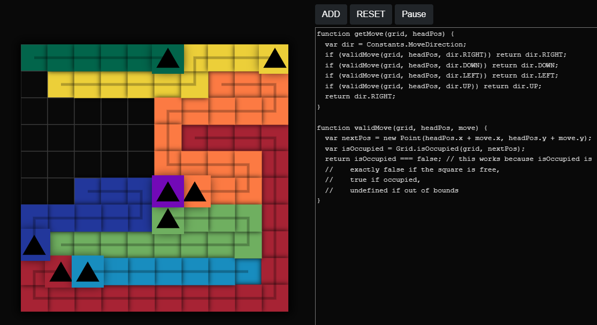

# tronbox

Tron bots that battle... in a box? This is a work in progress.

See it in action: https://sladewasinger.github.io/tronbox/

# Project Info:

- Vue.js 3 SPA
- Node.js
- Express API

# First-time installation

- Install Node.js on WSL: https://docs.microsoft.com/en-us/windows/dev-environment/javascript/nodejs-on-wsl
  - Alternatively, install Node for Windows if you are using anything but wsl.
- `npm install -g @vue.js/cli`

# Run the app:

### Terminal 1 (Frontend - Vue.js):

- `cd spa/src`
- `npm install` (first-time only)
- `npm run start` (saved changes are automatically updated in running app)

### Terminal 2 (Backend - Node.js Express API):

_The following steps are completely unnecessary since the API is empty._

- `cd api`
- `npm run start`

# Building/Deploying:

I am using [github pages](https://pages.github.com/) to host this repo.
There are 3 options for storing the deployment files:

- In the `docs/` folder of the **master** branch
- In the `/(root)` of the **master** branch
- In the `/(root)` of the **gh-pages** branch

I have chosen the `/(root)` folder in the `gh-pages` branch.

To get a fresh build, simply push changes to the master branch! I setup a github action™ to automatically build the Vue app, and then the github pages bot will take care of the actual deployment automatically.

The [github deployments](https://github.com/sladewasinger/tronbox/deployments) page will show deployments.
