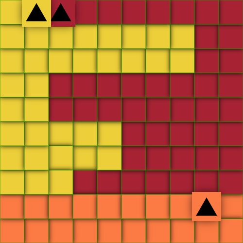

# tronbox

Tron bots that battle... in a box?

# Project Info:

- Node.js
- Express API
- Vue.js 3 SPA

# Notes for me (Austin):

_Run everything from wsl (ubuntu)_

## First-time installation

- Install Node.js on WSL: https://docs.microsoft.com/en-us/windows/dev-environment/javascript/nodejs-on-wsl
- npm install -g @vue.js/cli

## Run the app:

### Terminal 1 (Frontend - Vue.js):

- `cd spa/src`
- `npm run start` (saved changes are automatically updated in running app)

### Terminal 2 (Backend - Node.js Express API):

- `cd api`
- `npm run start`

## Where I left off...

https://medium.com/bb-tutorials-and-thoughts/how-to-develop-and-build-vue-js-app-with-nodejs-bd86feec1a20
Section: (How To Build Project For Production)
